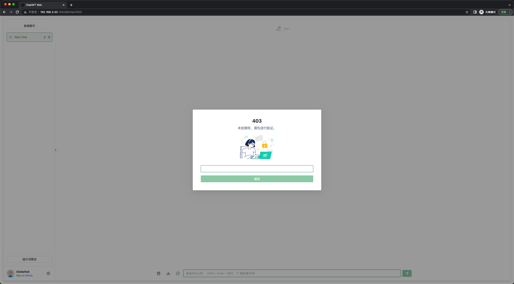
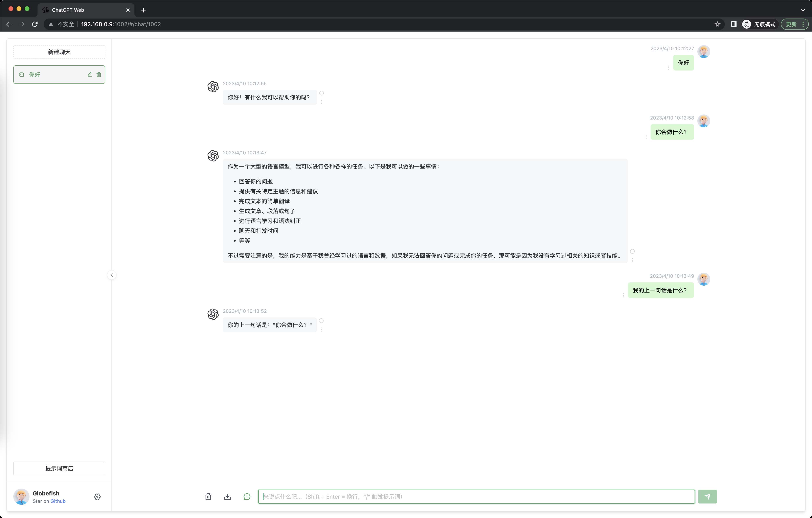
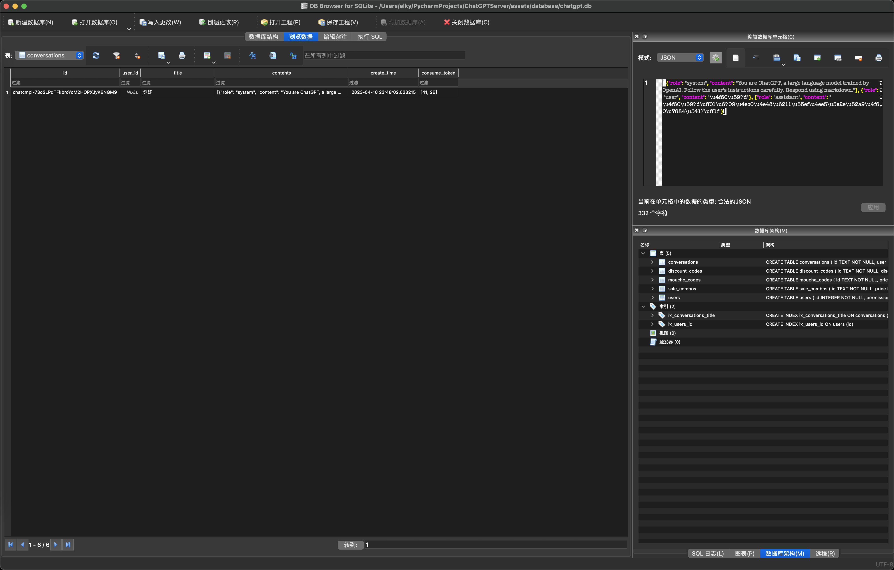

# chat-web项目的python后端

原项目：[ChatGPT Web](https://github.com/Chanzhaoyu/chatgpt-web)

仅支持Api调用模式，需要accessToken的可以自行扩展。

使用FastAPI实现接口、SQLite实现记忆会话。

与原项目后端对比，未实现TIME_MS超时、MAX_REQUEST_PER_HOUR速率限制功能。可自行扩展。

数据库可视化使用 [DB Browser for SQLite](https://sqlitebrowser.org/dl/)

由于使用了海象运算符，Python最低要求3.8。  

启动方式：（推荐使用conda）
复制 .env.example 重命名为 .env  
配置OPENAI_API_KEY 和 AUTH_SECRET_KEY
```bash
conda create -n chat-web-service python=3.11
conda activate chat-web-servic
pip install -r requirements.txt
nohup python -m gunicorn fastapi_chatgpt_server:app --workers 1 --worker-class uvicorn.workers.UvicornWorker --bind 0.0.0.0:3002 >/dev/null 2>&1 &
```
查询进程
```bash
pstree -ap|grep gunicorn
```
关闭进程
```bash
kill -9 pid  # pid：查询到的进程id
```
重启进程
```bash
kill -HUP pid
```





